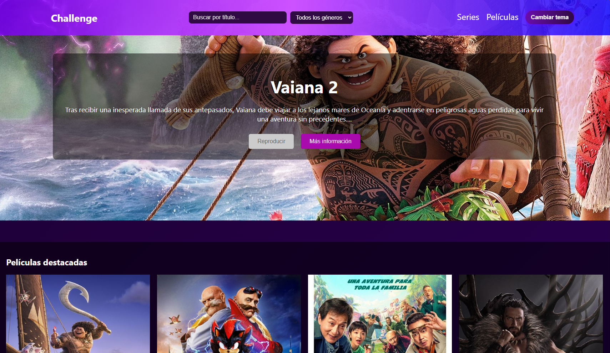
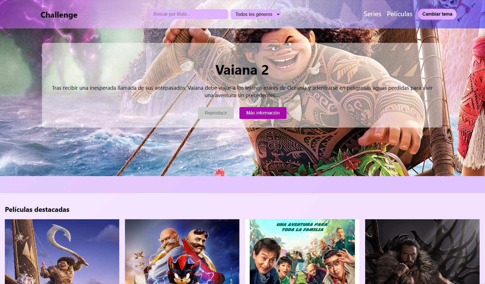

# Lunala Challenge - Plataforma de Streaming 🎬

Hice una aplicación de streaming inspirada en Netflix, desarrollada con **React**. Permite a los usuarios explorar películas y series, filtrarlas por género y buscar contenido de manera eficiente. La interfaz de usuario tiene un diseño moderno con tonos violetas y fucsia, armonizando una estética vibrante y atractiva.

Puedes ver el website desplegado en: [Netlify Lunala-Challenge](https://lunala-challenge.netlify.app/).

# Preview en modo oscuro


# Preview en modo claro


## 🚀 Instalación

Para ejecutar este proyecto localmente, sigue estos pasos:

### 1️⃣ Clona el repositorio

```bash
git clone https://github.com/KingGh0st/lunala-challenge.git
cd lunala-challenge
```

### 2️⃣ Instala las dependencias

```bash
npm install
```

### 3️⃣ Inicia la aplicación

```bash
npm start
```

La aplicación estará disponible en `http://localhost:3000/`.

---

## 🎨 Diseño y Estética

El diseño para este challenge de **Lunala** se basa en una combinación de colores **violetas y fucsia**, buscando un balance entre modernidad y elegancia. Algunas decisiones clave de diseño incluyen:

- **Modo Oscuro y Claro** 🌙☀️: Implementado con una paleta de colores en tonos violetas oscuros y claros.
- **Gradientes Dinámicos** 🎨: Se usaron fondos con transiciones suaves para mejorar la estética visual.
- **Transiciones Animadas** 🔄: Se implementaron efectos de desvanecimiento entre páginas con `Framer Motion`.
- **Tipografía y Espaciado** ✍️: Se optimizaron tamaños de fuente y márgenes para mejorar la legibilidad.

---

## 🛠️ Tecnologías Usadas

- **React** ⚛️ - Para la construcción de la interfaz.
- **React Router** 🛤 - Manejo de navegación entre páginas.
- **SCSS** 🎨 - Estilización con modularidad.
- **Framer Motion** 💫 - Animaciones fluidas.
- **TMDB API** 🎥 - Base de datos de películas y series.

---

## 🔍 Funcionalidades

✅ **Exploración de Películas y Series** 🎬📺\
✅ **Filtro por Géneros** 🎭\
✅ **Búsqueda en Tiempo Real** 🔎\
✅ **Modo Oscuro/Claro** 🌗\
✅ **Animaciones y Transiciones Suaves** 🎞

---

## 📌 Uso

1️⃣ Inicia la aplicación con `npm start`. 2️⃣ Navega entre películas y series. 3️⃣ Usa la barra de búsqueda para encontrar títulos específicos. 4️⃣ Filtra por género desde el menú de navegación. 5️⃣ Alterna entre modo claro y oscuro con el botón en el header.
